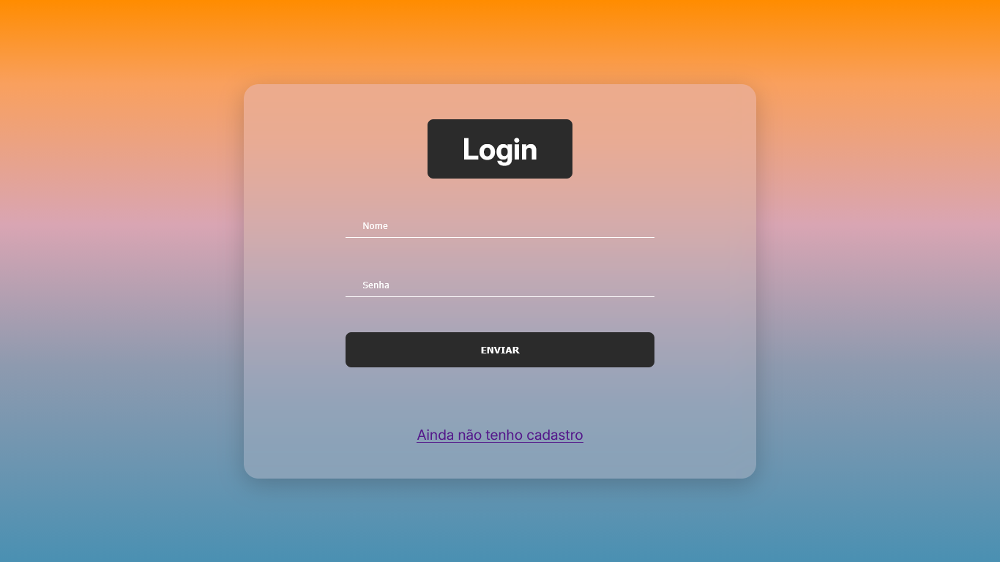
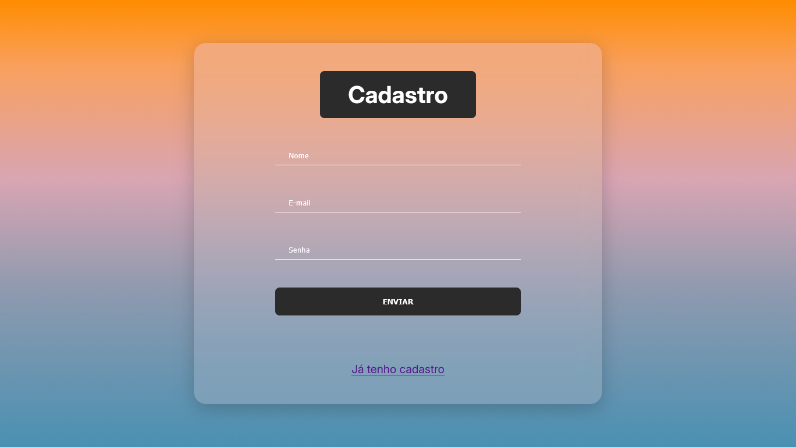
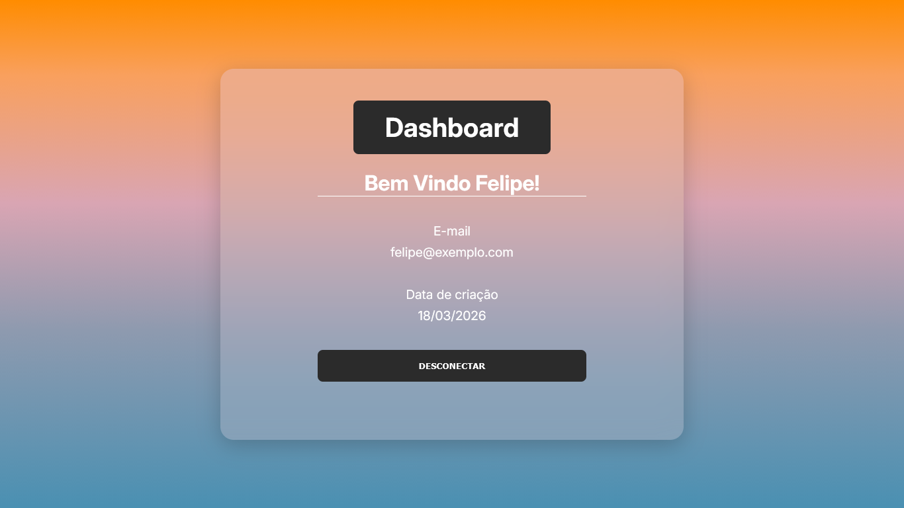
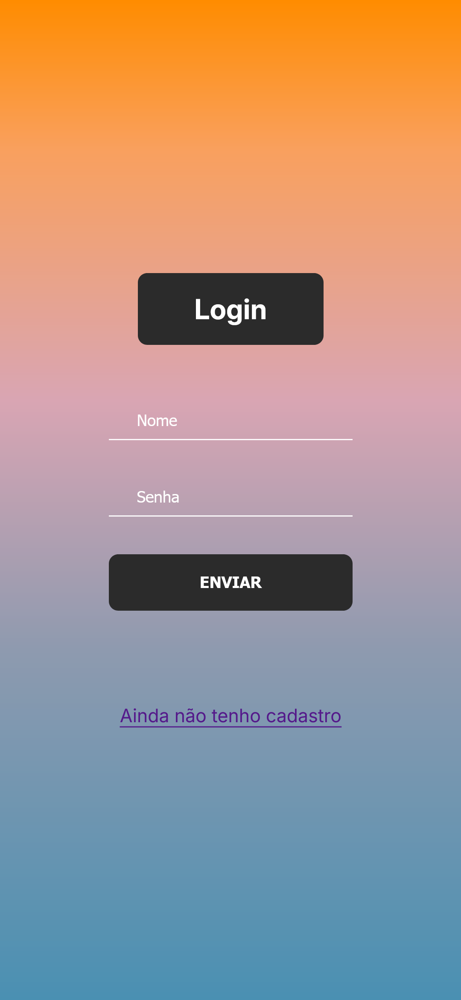
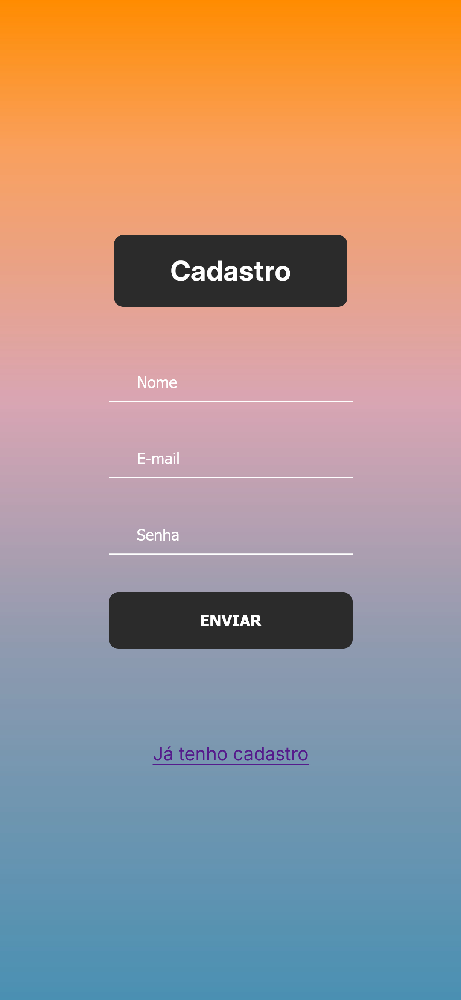

# 📌 PHP Auth System

<p align="center">
  
</p>

Sistema de autenticação completo com cadastro e login de usuários, desenvolvido com PHP e PostgreSQL, aplicando arquitetura MVC, boas práticas de segurança e containerização com Docker.


O PHP Auth System é uma aplicação web que implementa um fluxo básico de autenticação, permitindo cadastro e login de usuários.

## 🚀 Sobre o projeto

O **PHP Auth System** é uma aplicação web que implementa um fluxo básico de autenticação, permitindo cadastro e login de usuários.

Este projeto foi desenvolvido com o objetivo de aprofundar conhecimentos em desenvolvimento backend, arquitetura de software e integração com banco de dados.

🛠️ Tecnologias utilizadas

## 🎯 Objetivo

- Entender como funciona uma aplicação web completa  
- Implementar autenticação de usuários  
- Trabalhar com arquitetura MVC  
- Praticar integração com banco de dados real  
- Aprender conceitos de API REST e preparação para consumo  

Arquitetura: MVC

## 🛠️ Tecnologias utilizadas

- **Backend:** PHP  
- **Banco de dados:** PostgreSQL  
- **Conexão com banco:** PDO  
- **Frontend:** HTML, CSS, JavaScript  
- **Arquitetura:** MVC  
- **Containerização:** Docker  
- **Configuração de ambiente:** .env  

Exibição de dados do usuário:

## ⚙️ Funcionalidades

- Cadastro de usuário (nome, email e senha)  
- Login de usuário  
- Exibição de dados do usuário:
  - Nome  
  - Email  
  - Data de criação  

---

## 🔐 Segurança

- Hash de senha para proteção de credenciais  
- Validação de dados no frontend e backend  
- Uso de variáveis de ambiente com `.env`  

---

## 🧠 Conceitos aplicados

- Arquitetura MVC  
- Separação de responsabilidades  
- Estruturação de backend do zero  
- Introdução a APIs REST  
- Responsividade com CSS (media queries e root)  

---

## 🐳 Containerização

O projeto utiliza **Docker** para facilitar a execução e padronização do ambiente, incluindo:

- Criação de container para aplicação  
- Uso de Dockerfile (substituindo servidor interno do PHP)  
- Integração com banco de dados via container  

---

## 📦 Como executar o projeto

```bash
# Clonar o repositório
git clone https://github.com/seu-usuario/php-auth-system.git

# Entrar na pasta
cd php-auth-system

# Criar arquivo .env baseado no exemplo
cp .env.example .env

# Subir os containers
docker-compose up --build
```
## 🚧 Status do projeto

🟡 Em desenvolvimento  

### Atualmente em progresso:

- Implementação da camada Model  
- Definição de rotas  
- Criação de Services  
- Desenvolvimento e consumo de API REST  

---

## 📸 Interface

### 🖥️ Versão Desktop

#### 🔐 Tela de Login


#### 📝 Tela de Cadastro


#### 👤 Tela após Login


---

### 📱 Versão Mobile

#### 🔐 Tela de Login


#### 📝 Tela de Cadastro

---

## 📈 Aprendizados

Durante o desenvolvimento deste projeto, aprimorei conhecimentos como:

- Funcionamento completo de autenticação (login e cadastro)
- Estruturação de aplicações backend com MVC
- Integração com banco de dados PostgreSQL usando PDO
- Conceitos iniciais de APIs REST
- Importância de validações e segurança em aplicações web
- Organização e padronização de código

---

## 🔮 Próximos passos

- Finalizar estrutura de API REST  
- Implementar consumo da API no frontend  
- Adicionar testes  
- Melhorar validações e tratamento de erros  

---

## 👨‍💻 Autor

Desenvolvido por **Felipe Gonçalves** 😄
